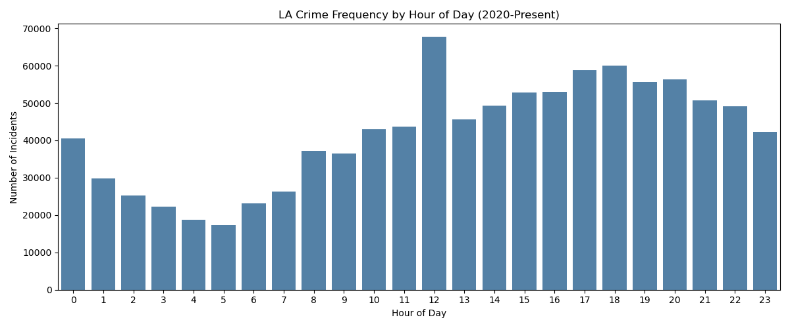
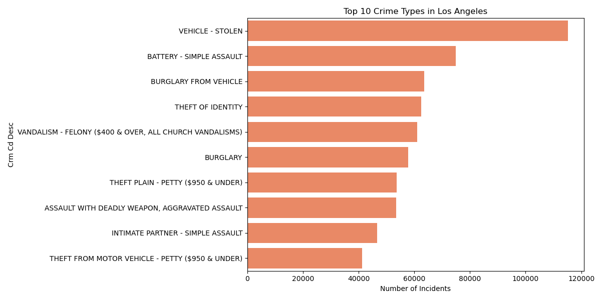
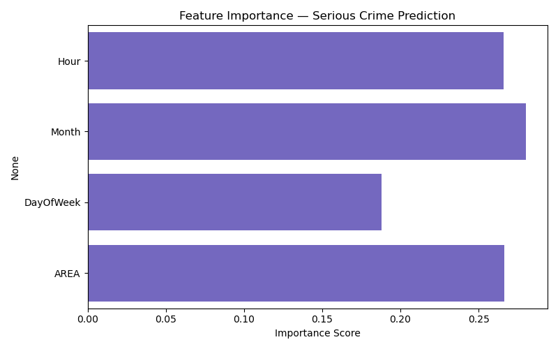
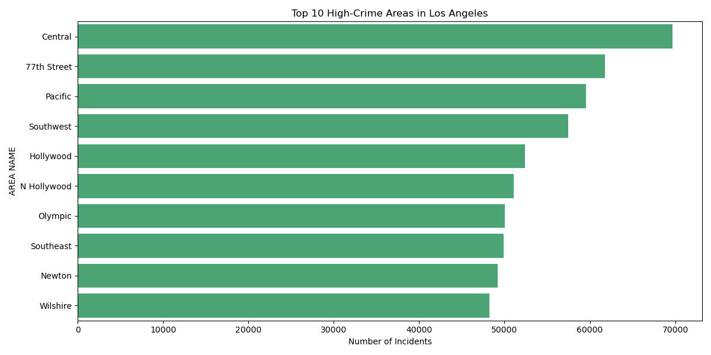

1. LA Crime Predictive Modeling

An end-to-end machine learning pipeline analyzing **1,004,894 LAPD crime 
records (2020–2024)** to identify patterns and predict serious crime 
classification using temporal and geographic features.

2. Key Findings
- **Peak crime hour:** 12:00 PM (noon)
- **Most common crime:** Vehicle Theft
- **Highest crime area:** Central LA
- **Model accuracy:** 58.43% on serious vs. non-serious crime classification
- **Dataset span:** January 2020 – December 2024 across 140 unique crime types

3. Tools & Technologies
- **Language:** Python
- **Libraries:** Pandas, NumPy, scikit-learn, Matplotlib, Seaborn
- **Model:** Random Forest Classifier
- **Dataset:** [LA Crime Data 2020–Present](https://data.lacity.org)

4. Pipeline

| Step | File               | Description |
|------|------              |-------------|
| 1    | `data_cleaning.py` | Load, clean, parse dates, extract features |
| 2    | `analysis.py`      | Exploratory analysis and visualizations |
| 3    | `model.py`         | Random Forest classifier + feature importance |

5. Model Performance

Predicting **serious vs. non-serious** crime classification:

| Metric       | Non-Serious | Serious |
|--------      |-------------|---------|
| Precision    | 0.47        | 0.62    |
| Recall       | 0.27        | 0.80    |
| F1-Score     | 0.34        | 0.70    |
| **Accuracy** |             | **58.43%** |

> Note: Accuracy above a 50% baseline demonstrates meaningful signal 
> from temporal and geographic features alone.

6. Visualizations

### Crime Frequency by Hour


### Top 10 Crime Types


### Feature Importance


### Top Crime Areas


7. How to Run
```bash
# Install dependencies
pip install pandas matplotlib seaborn scikit-learn

# Run pipeline in order
python data_cleaning.py    # Clean and prepare data
python analysis.py         # Generate visualizations  
python model.py            # Train model and evaluate
```

8. Insights & Takeaways
- **Hour and Area** are the strongest predictors of crime seriousness
- Vehicle theft dominates LA crime reports across all years
- Central LA consistently shows the highest incident volume
- Temporal patterns suggest resource allocation opportunities 
  for law enforcement during peak hours

9. Author
**Sakshi Patel** — University of Connecticut 
[LinkedIn](https://linkedin.com/in/sakshipatel) · 
[GitHub](https://github.com/sakshipatel4)
